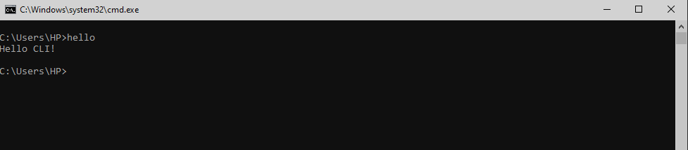
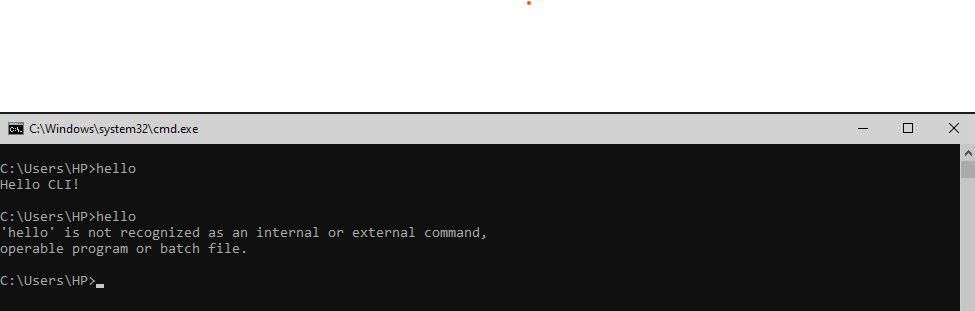

## This is simplest cli tool which prints text to console

To make this command line tool work clone this repo, in your local pc:

```cmd
git clone https://github.com/eziz-hudayberdiyev/simple-hello-cli.git
```

Then run this app from the folder you cloned via following command

```cmd
npm install -g .
```

This installs script globally, so you can type hello at the command line:

```cmd
hello
```

Following image is tested case using cmd on windows 10 machine



To uninstall cli-tool, run the following command:

```cmd
npm uninstall -g cli-app-by-node
```

Screenshot of command line after uninstalling script


